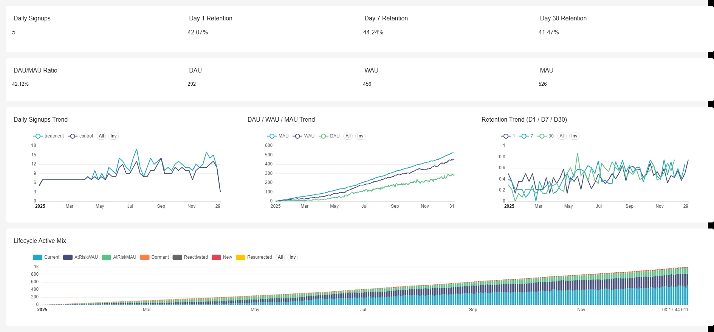
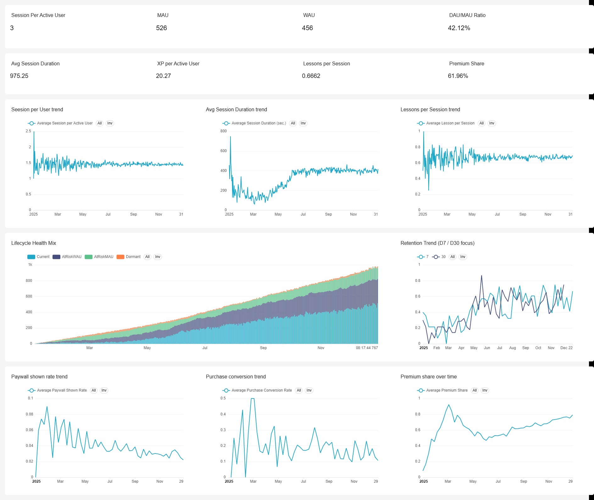
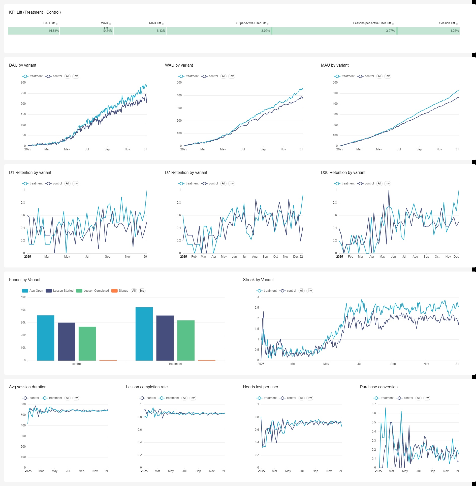

# Growth Model Project

A Duolingo-style product analytics project for simulating user growth, engagement, retention, and experimentation in a learning app environment.

This project is designed as a **growth analytics sandbox**: it generates realistic synthetic product data, defines a reusable metrics layer, and supports dashboarding for different stages of product development.

---

## Project Goal

The goal of this project is to build an end-to-end product analytics workflow that resembles a real consumer app setting.

The project includes:

- a **synthetic event-based product dataset**
- a **metrics layer** for standardized KPI definitions
- a **dashboarding layer** for growth analysis, mature-stage health tracking, and A/B test monitoring

The simulated product is inspired by a **Duolingo-like language learning app**, with user activity driven by lifecycle transitions, engagement behavior, and treatment effects from experiments.

---

## Expected End Products

This project is intended to produce **three dashboards**:

### 1. Growth Overview Dashboard
Tracks early-stage growth and activation.

Typical questions:
- Are new users signing up consistently?
- Are users becoming active after signup?
- Is retention improving?
- Are we building habit loops?

Core metrics:
- Daily signups
- DAU / WAU / MAU
- Activation funnel
- D1 / D7 / D30 retention
- Lifecycle mix: New, Current, Reactivated, Resurrected

---

### 2. Mature Product Health Dashboard
Tracks product stability, engagement depth, and user health in a more mature phase.

Typical questions:
- Is the product sustaining engagement over time?
- Are users becoming at-risk or dormant?
- How deep is usage among active users?
- Are monetization and premium signals improving?

Core metrics:
- Retention trends
- Sessions per active user
- Average session duration
- Lessons per session
- XP per user
- Premium conversion / premium usage
- Lifecycle mix: Current, At Risk WAU, At Risk MAU, Dormant

---

### 3. A/B Test Dashboard
Tracks experimental performance over time.

Typical questions:
- Is treatment outperforming control?
- When does the treatment effect appear?
- Does the effect fade as the product matures?
- Which metrics are most affected?

Core metrics:
- DAU / WAU / MAU by variant
- Retention by variant
- Funnel conversion by variant
- Streak / habit metrics
- Treatment lift over time
- Guardrail metrics such as session duration or lesson completion

---