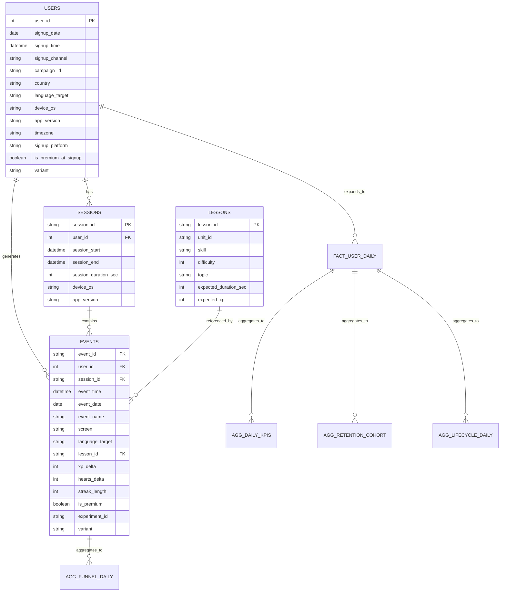

# Data Schema (Phase 1)

## Growth Model Project  
**Duolingo-style product analytics simulation + dashboard-serving schema**

---

## 1. Purpose

This project simulates a Duolingo-style learning product and is designed to support three dashboard families:

1. **Growth Overview Dashboard**
2. **Mature Product Health Dashboard**
3. **A/B Test Dashboard**

To support those dashboards cleanly, the data model is organized into:

- **core raw tables** for flexible analysis
- **derived metric tables / views** for fast and consistent dashboarding

The core raw schema already follows a realistic product analytics structure built around `users`, `sessions`, `events`, and `lessons`. :contentReference[oaicite:0]{index=0}  
The metrics layer is intended to act as the single source of truth for KPI definitions such as DAU, WAU, MAU, retention, funnels, and lifecycle counts. :contentReference[oaicite:1]{index=1} :contentReference[oaicite:2]{index=2}

---

## 2. Design Principles

This schema is designed with five goals:

1. **Reflect realistic product telemetry**
   - user signups
   - sessions
   - event logs
   - lesson/content metadata

2. **Support dashboarding directly**
   - KPI cards
   - trend charts
   - cohort retention
   - funnels
   - lifecycle decomposition
   - A/B test comparisons

3. **Keep raw data flexible**
   - most logic should be derivable from the event stream and user table

4. **Separate raw from derived**
   - raw tables store behavior
   - derived tables store reusable business metrics

5. **Keep definitions consistent**
   - dashboard metrics should match the definitions in the metrics layer

---

## 3. Schema Overview

### 3.1 Core raw tables

These are the main source tables:

- `users`
- `sessions`
- `events`
- `lessons`

### 3.2 Derived dashboard tables / views

These are recommended for dashboard serving:

- `fact_user_daily`
- `agg_daily_kpis`
- `agg_retention_cohort`
- `agg_funnel_daily`
- `agg_lifecycle_daily`

---

## 4. Entity Relationship Overview

## 5. Core Raw Tables

The Phase 1 raw schema consists of four main tables:

- `users`
- `sessions`
- `events`
- `lessons`

These tables are the canonical source data for the project.  
All dashboards and most downstream analyses should be derived from them.

---

### 5.1 Table: `users`

**Grain:** 1 row = 1 user  
**Primary key:** `user_id`

This table stores user-level attributes and signup information. It is the main source for:

- cohorting
- acquisition analysis
- segmentation
- experiment assignment

#### Columns

| Column | Type | Description |
|---|---|---|
| `user_id` | int | Unique user identifier |
| `signup_date` | date | User signup date |
| `signup_time` | datetime | Exact signup timestamp |
| `signup_channel` | string | Acquisition channel such as `organic`, `paid`, or `referral` |
| `campaign_id` | string | Campaign identifier, mainly for paid acquisition |
| `country` | string | Country code |
| `language_target` | string | Target language being learned |
| `device_os` | string | Device OS at signup |
| `app_version` | string | App version at signup |
| `timezone` | string | User timezone |
| `signup_platform` | string | Platform such as `mobile` or `web` |
| `is_premium_at_signup` | boolean | Whether the user was premium at signup |
| `variant` | string | Experiment assignment such as `control` or `treatment` |

#### Notes
- `variant` should be treated as the canonical experiment assignment for A/B analysis.
- `signup_date` is the cohort anchor for D1, D7, and D30 retention.
- This table is especially important for the Growth Overview and A/B Test dashboards.

---

### 5.2 Table: `sessions`

**Grain:** 1 row = 1 session  
**Primary key:** `session_id`  
**Foreign key:** `user_id` → `users.user_id`

This table stores contiguous app usage windows. It is the main source for:

- session depth
- engagement quality
- average session duration
- sessions per active user
- experiment guardrail metrics

#### Columns

| Column | Type | Description |
|---|---|---|
| `session_id` | string | Unique session identifier |
| `user_id` | int | User identifier |
| `session_start` | datetime | Session start timestamp |
| `session_end` | datetime | Session end timestamp |
| `session_duration_sec` | int | Session duration in seconds |
| `device_os` | string | Device OS during the session |
| `app_version` | string | App version during the session |

#### Optional future columns
These are not required in Phase 1, but may be added later if useful:
- `session_date`
- `variant`
- `is_premium`
- `session_index_for_user`
- `lessons_completed_in_session`

#### Notes
- `session_duration_sec` should equal `session_end - session_start` within tolerance.
- This table is especially useful for the Mature Product Health dashboard.

---

### 5.3 Table: `events`

**Grain:** 1 row = 1 event  
**Primary key:** `event_id`

**Foreign keys**
- `user_id` → `users.user_id`
- `session_id` → `sessions.session_id`
- `lesson_id` → `lessons.lesson_id`

This is the central fact table of the project.  
It is the main source for:

- DAU / WAU / MAU
- retention activity checks
- funnel analysis
- streak metrics
- paywall and purchase behavior
- experiment tracking

#### Columns

| Column | Type | Description |
|---|---|---|
| `event_id` | string | Unique event identifier |
| `user_id` | int | User identifier |
| `session_id` | string | Session identifier; may be empty for non-session events |
| `event_time` | datetime | Event timestamp |
| `event_date` | date | Local event date |
| `event_name` | string | Event type |
| `screen` | string | Product screen or context |
| `language_target` | string | Target language for convenience |
| `lesson_id` | string | Related lesson identifier when applicable |
| `xp_delta` | int | XP gained or lost on the event |
| `hearts_delta` | int | Hearts change on the event |
| `streak_length` | int | Streak length at event time |
| `is_premium` | boolean | Premium status at event time |
| `experiment_id` | string | Experiment identifier |
| `variant` | string | Experiment arm |

#### Event taxonomy

**Acquisition and onboarding**
- `signup`
- `onboarding_completed`
- `paywall_shown`
- `purchase`

**Core engagement**
- `app_open`
- `app_background`
- `push_received`
- `push_opened`

**Learning flow**
- `lesson_started`
- `question_answered`
- `lesson_completed`

**Habit mechanics**
- `streak_incremented`
- `streak_broken`
- `streak_repaired`

#### Notes
- The default active event set should be:
  - `app_open`
  - `lesson_started`
  - `lesson_completed`
- This table is the most important source for all three dashboards.

---

### 5.4 Table: `lessons`

**Grain:** 1 row = 1 lesson  
**Primary key:** `lesson_id`

This is the content dimension table. It supports:

- lesson analysis
- difficulty segmentation
- topic analysis
- expected duration benchmarking
- XP benchmarking

#### Columns

| Column | Type | Description |
|---|---|---|
| `lesson_id` | string | Unique lesson identifier |
| `unit_id` | string | Unit or chapter identifier |
| `skill` | string | Skill label |
| `difficulty` | int | Difficulty level, typically 1–5 |
| `topic` | string | Topic category |
| `expected_duration_sec` | int | Expected lesson duration |
| `expected_xp` | int | Expected XP reward |

#### Notes
- This table mainly supports content and engagement analysis.
- It is especially useful in the Mature Product Health dashboard.

---

## 6. Recommended Derived Tables / Views

The raw tables are sufficient for flexible analysis, but dashboarding is much easier if we also maintain a small set of derived tables or materialized views.

Recommended derived tables:

- `fact_user_daily`
- `agg_daily_kpis`
- `agg_retention_cohort`
- `agg_funnel_daily`
- `agg_lifecycle_daily`

These should be treated as dashboard-serving tables, not the raw source of truth.

---

### 6.1 Table / View: `fact_user_daily`

**Grain:** 1 row = 1 user × 1 date

This is the most useful dashboard-serving table in the schema.  
It summarizes each user’s daily activity and state.

#### Purpose
Supports:
- DAU / WAU / MAU construction
- lifecycle classification
- retention checks
- user-day experiment analysis
- faster BI queries

#### Suggested columns

| Column | Type | Description |
|---|---|---|
| `date` | date | Calendar date |
| `user_id` | int | User identifier |
| `variant` | string | Experiment arm |
| `signup_date` | date | User signup date |
| `days_since_signup` | int | Days since signup |
| `is_active` | boolean | Whether the user had at least one active event that day |
| `had_app_open` | boolean | Whether the user had an `app_open` event |
| `had_lesson_started` | boolean | Whether the user had a `lesson_started` event |
| `had_lesson_completed` | boolean | Whether the user had a `lesson_completed` event |
| `sessions_count` | int | Number of sessions that day |
| `session_duration_sec` | int | Total session duration that day |
| `lessons_completed` | int | Lessons completed that day |
| `xp_earned` | int | Total XP earned that day |
| `hearts_lost` | int | Total hearts lost that day |
| `streak_length_end_of_day` | int | End-of-day streak length |
| `is_premium` | boolean | Premium status at end of day |
| `lifecycle_state` | string | Derived lifecycle state |

#### Lifecycle state values
Recommended values:
- `New`
- `Current`
- `Reactivated`
- `Resurrected`
- `AtRiskWAU`
- `AtRiskMAU`
- `Dormant`

#### Notes
- This table is optional in raw storage, but strongly recommended for dashboard use.
- It is especially useful when building lifecycle charts and retention views.

---

### 6.2 Table / View: `agg_daily_kpis`

**Grain:** 1 row = 1 date × optional grouping dimension  
Recommended base grouping:
- `date`
- `variant`

This table stores daily KPI outputs used by top-line charts and dashboard cards.

#### Purpose
Supports:
- KPI rows
- daily trend charts
- treatment vs control comparisons

#### Suggested columns

| Column | Type | Description |
|---|---|---|
| `date` | date | Calendar date |
| `variant` | string | Experiment arm |
| `signups` | int | Number of users who signed up that day |
| `dau` | int | Daily active users |
| `wau` | int | Weekly active users |
| `mau` | int | Monthly active users |
| `dau_mau_ratio` | float | DAU divided by MAU |
| `sessions` | int | Number of sessions |
| `avg_session_duration_sec` | float | Average session duration |
| `sessions_per_active_user` | float | Sessions divided by active users |
| `lessons_completed` | int | Number of completed lessons |
| `lessons_per_active_user` | float | Lessons completed divided by active users |
| `xp_earned` | int | Total XP earned |
| `xp_per_active_user` | float | XP divided by active users |
| `premium_users` | int | Number of premium users on that day |
| `premium_share` | float | Premium users divided by the selected base |

#### Notes
- This is a dashboard-serving aggregate, not the canonical source of truth.
- It is especially useful for the KPI rows in all three dashboards.

---

### 6.3 Table / View: `agg_retention_cohort`

**Grain:** 1 row = `cohort_date` × `day_n` × optional `variant`

This is the main retention output table.

#### Purpose
Supports:
- D1 / D7 / D30 cards
- cohort retention charts
- retention heatmaps
- treatment vs control retention comparisons

#### Suggested columns

| Column | Type | Description |
|---|---|---|
| `cohort_date` | date | Signup cohort date |
| `variant` | string | Experiment arm |
| `day_n` | int | Retention day such as 1, 7, or 30 |
| `cohort_size` | int | Number of users in the cohort |
| `retained_users` | int | Number of retained users on day `n` |
| `retention_rate` | float | `retained_users / cohort_size` |

#### Notes
- This table is one of the most important sources for the Growth Overview and A/B Test dashboards.
- It should be computed from the canonical retention definition.

---

### 6.4 Table / View: `agg_funnel_daily`

**Grain:** 1 row = `date` × optional `variant`

This table stores activation and lesson funnel metrics.

#### Purpose
Supports:
- signup-to-lesson funnel
- daily conversion trends
- treatment vs control funnel comparison

#### Suggested columns

| Column | Type | Description |
|---|---|---|
| `date` | date | Calendar date |
| `variant` | string | Experiment arm |
| `n_signup` | int | Users who signed up |
| `n_app_open` | int | Users with at least one app open |
| `n_lesson_started` | int | Users who started at least one lesson |
| `n_lesson_completed` | int | Users who completed at least one lesson |
| `cr_app_open_given_signup` | float | `n_app_open / n_signup` |
| `cr_lesson_started_given_app_open` | float | `n_lesson_started / n_app_open` |
| `cr_lesson_completed_given_lesson_started` | float | `n_lesson_completed / n_lesson_started` |

#### Optional extension
You may also create `agg_funnel_cohort` with grain:
- `cohort_date`
- `variant`

This is useful when funnel performance should be tracked by signup cohort rather than calendar day.

---

### 6.5 Table / View: `agg_lifecycle_daily`

**Grain:** 1 row = `date` × `state` × optional `variant`

This table stores the daily lifecycle decomposition of the user base.

#### Purpose
Supports:
- lifecycle composition charts
- active-state decomposition
- at-risk and dormant monitoring
- experiment analysis by lifecycle state

#### Suggested columns

| Column | Type | Description |
|---|---|---|
| `date` | date | Calendar date |
| `variant` | string | Experiment arm |
| `state` | string | Lifecycle state |
| `users` | int | Number of users in that state on that date |

#### Lifecycle states
Use:
- `New`
- `Current`
- `Reactivated`
- `Resurrected`
- `AtRiskWAU`
- `AtRiskMAU`
- `Dormant`

#### Notes
- This table is critical for the Growth Overview and Mature Product Health dashboards.
- It is the cleanest way to build stacked lifecycle charts.

---

## 7. Metric Definitions Supported by the Schema

The schema is designed to support the following product metrics.

### 7.1 Active user definition
A user is active on date `d` if they have at least one event in:
- `app_open`
- `lesson_started`
- `lesson_completed`

### 7.2 Core KPIs
- DAU
- WAU
- MAU
- DAU / MAU ratio
- sessions per active user
- average session duration
- lessons per active user
- XP per active user
- premium share

### 7.3 Retention
- D1 retention
- D7 retention
- D30 retention

### 7.4 Funnel
- signup
- app open
- lesson started
- lesson completed

### 7.5 Lifecycle metrics
- New
- Current
- Reactivated
- Resurrected
- AtRiskWAU
- AtRiskMAU
- Dormant

### 7.6 Experiment metrics
All major metrics should support grouping by:
- `variant`
- and optionally other segment dimensions such as country, device OS, or signup channel

---

## 8. Dashboard Mapping

### 8.1 Growth Overview Dashboard

#### Main source tables
- `users`
- `events`
- `agg_daily_kpis`
- `agg_retention_cohort`
- `agg_funnel_daily`
- `agg_lifecycle_daily`

#### Main metrics
- daily signups
- DAU / WAU / MAU
- D1 / D7 / D30 retention
- activation funnel
- lifecycle active mix

---

### 8.2 Mature Product Health Dashboard

#### Main source tables
- `sessions`
- `events`
- `lessons`
- `agg_daily_kpis`
- `agg_lifecycle_daily`

#### Main metrics
- sessions per active user
- average session duration
- lessons per session
- XP per active user
- premium share
- lifecycle risk mix
- retention trends

---

### 8.3 A/B Test Dashboard

#### Main source tables
- `users`
- `events`
- `sessions`
- `agg_daily_kpis`
- `agg_retention_cohort`
- `agg_funnel_daily`
- `agg_lifecycle_daily`

#### Main metrics
- DAU / WAU / MAU by variant
- retention by variant
- funnel conversion by variant
- streak metrics by variant
- guardrail metrics by variant

---

## 9. Data Quality Rules

### 9.1 Key constraints
- `users.user_id` must be unique and non-null
- `sessions.session_id` must be unique and non-null
- `events.event_id` must be unique and non-null
- `lessons.lesson_id` must be unique and non-null

### 9.2 Referential integrity
- `sessions.user_id` must exist in `users`
- `events.user_id` must exist in `users`
- `events.session_id` should exist in `sessions` when present
- `events.lesson_id` must exist in `lessons` for lesson-related events

### 9.3 Logical rules
- `session_end >= session_start`
- `session_duration_sec >= 0`
- `streak_length >= 0`
- if `event_name = lesson_completed`, then `xp_delta >= 0`
- lesson flow events should have valid `lesson_id`

### 9.4 Ordering
- sessions should be ordered by `user_id`, `session_start`
- events should be ordered by `user_id`, `event_time`

---

## 10. Minimum Viable Schema for Phase 1

If the goal is to support all three dashboards with minimal complexity, the minimum required tables are:

### Core raw tables
- `users`
- `sessions`
- `events`
- `lessons`

### Recommended derived tables
- `agg_daily_kpis`
- `agg_retention_cohort`
- `agg_funnel_daily`
- `agg_lifecycle_daily`

### Strongly recommended optional table
- `fact_user_daily`

This is the best balance between realism and manageability for Phase 1.

---

## 11. Final Recommendation

For Phase 1, keep the raw schema simple and stable:

- `users`
- `sessions`
- `events`
- `lessons`

Then build dashboard-serving tables from those raw sources:

- `fact_user_daily`
- `agg_daily_kpis`
- `agg_retention_cohort`
- `agg_funnel_daily`
- `agg_lifecycle_daily`

This structure keeps the project realistic, analytically flexible, and easy to use in notebooks, SQL, or BI tools.