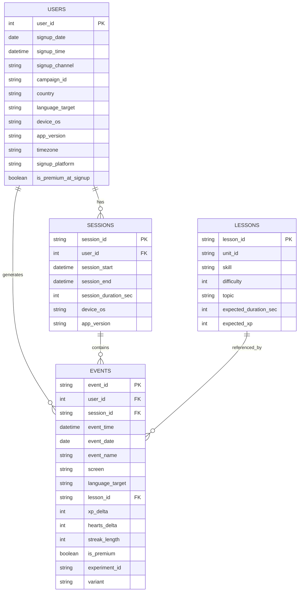

# Data Schema (Phase 1 — Rich Version)

This project simulates a Duolingo-style language learning app using a realistic product analytics structure:

- **users**: user attributes at signup (slow-changing)
- **sessions**: contiguous app usage windows (behavioral unit)
- **events**: event stream (product telemetry)
- **lessons**: content dimension table (what users learn)

The schema is designed to support:
- DAU/WAU/MAU
- retention cohorts (D1/D7/D30)
- funnels (signup → first_open → first_lesson → lesson_complete)
- engagement metrics (sessions/user, lessons/session, XP/user)
- streak dynamics (habit formation proxy)
- segmentation (channel/country/device/lesson difficulty)

---

## 0) ER Diagram (GitHub renders Mermaid)

---

## 1) Table: `users`

**Grain:** 1 row = 1 user

**Primary key:** `user_id`

| Column               | Type     | Example                   | Description                                   |
| -------------------- | -------- | ------------------------- | --------------------------------------------- |
| user_id              | int      | 102938                    | Unique user identifier                        |
| signup_date          | date     | 2025-01-03                | Date the user signed up (local to `timezone`) |
| signup_time          | datetime | 2025-01-03 09:21:05       | Timestamp of signup                           |
| signup_channel       | string   | organic / paid / referral | Acquisition channel                           |
| campaign_id          | string   | g_ads_2025w01             | Campaign identifier (optional but useful)     |
| country              | string   | AU / CN / US              | Country code (simplified)                     |
| language_target      | string   | EN / ES / JA              | Target language being learned                 |
| device_os            | string   | iOS / Android / Web       | Device OS at signup                           |
| app_version          | string   | 1.12.3                    | App version at signup                         |
| timezone             | string   | Australia/Perth           | User timezone (for local-day metrics)         |
| signup_platform      | string   | mobile / web              | Platform type                                 |
| is_premium_at_signup | bool     | true/false                | Premium status at signup                      |

**Notes**
- `is_premium` can be generated using a small probability that varies by channel/country.

---

## 2) Table: `sessions` 

**Grain:** 1 row = 1 session

**Primary key:** `session_id`

**Foregin key:** `user_id`

| Column               | Type     | Example             | Description                    |
| -------------------- | -------- | ------------------- | ------------------------------ |
| session_id           | string   | sess_8f21d9         | Unique session id              |
| user_id              | int      | 102938              | User id                        |
| session_start        | datetime | 2025-01-04 18:20:00 | Session start time             |
| session_end          | datetime | 2025-01-04 18:33:12 | Session end time               |
| session_duration_sec | int      | 792                 | Duration in seconds            |
| device_os            | string   | iOS                 | OS during the session          |
| app_version          | string   | 1.12.4              | App version during the session |

---

## 3) Table: `lessons`

**Grain:** 1 row = 1 lesson

**Foreign key:** `lesson_id`

| Column                | Type   | Example      | Description             |
| --------------------- | ------ | ------------ | ----------------------- |
| lesson_id             | string | L_U03_S02_07 | Lesson unique id        |
| unit_id               | string | U03          | Unit / chapter          |
| skill                 | string | Past Tense   | Skill label             |
| difficulty            | int    | 3            | 1–5 difficulty          |
| topic                 | string | Travel       | Topic category          |
| expected_duration_sec | int    | 180          | Typical lesson duration |
| expected_xp           | int    | 15           | Typical XP reward       |

**Why this matters**
- Enables segmentation: retention by difficulty, engagement by topic, etc.s

## 4) Table: `events`

**Grain:** 1 row = 1 event 

**Primary Key:** `event_id`

**Foreign Key:** 
- `user_id` → `users.user_id`
- `session_id` → `sessions.session_id` 
- `lesson_id` → `lessons.lesson_id`

| Column          | Type     | Example              | Description                                            |
| --------------- | -------- | -------------------- | ------------------------------------------------------ |
| event_id        | string   | evt_000001           | Unique event identifier                                |
| user_id         | int      | 102938               | User identifier                                        |
| session_id      | string   | sess_8f21d9          | Session identifier                                     |
| event_time      | datetime | 2025-01-04 18:23:10  | Timestamp of the event                                 |
| event_date      | date     | 2025-01-04           | Local date derived from `event_time` + `timezone`      |
| event_name      | string   | lesson_completed     | Event type (see taxonomy)                              |
| screen          | string   | home / lesson / shop | Screen context                                         |
| language_target | string   | EN                   | Copied for convenience (can be derived from users)     |
| lesson_id       | string   | L_U03_S02_07         | Lesson related to the event                            |
| xp_delta        | int      | 15                   | XP gained/lost for this event                          |
| hearts_delta    | int      | -1                   | “Hearts” change (mistake system)                       |
| streak_length   | int      | 6                    | Current streak length after this event                 |
| is_premium      | bool     | true/false           | Premium status at event time                           |
| experiment_id   | string   | exp_streak_nudge     | Experiment identifier (Phase 1: optional placeholders) |
| variant         | string   | control / treatment  | Experiment arm                                         |

**Notes** 
- Keeping `experiment_id` and `variant` now makes A/B testing feel seamless later, even if we doesn’t use them heavily in the beginning.

---

## 5) Event Taxonomy

Below are the events used in the synthetic event stream.

### 5.1 Acquisition & Onboarding

| event_name           | When it happens           | Typical screen |
| -------------------- | ------------------------- | -------------- |
| signup               | account created           | onboarding     |
| onboarding_completed | finished onboarding steps | onboarding     |
| paywall_shown        | paywall displayed         | shop           |
| purchase             | premium purchased         | shop           |

### 5.2 Core Engagement 

| event_name     | When it happens                   | Typical screen |
| -------------- | --------------------------------- | -------------- |
| app_open       | app opened / foregrounded         | home           |
| app_background | app sent to background            | (any)          |
| push_received  | user receives a push notification | (system)       |
| push_opened    | user opens app via push           | home           |

### 5.3 Learning Flow (lesson funnel)

| event_name        | When it happens    | Typical screen |
| ----------------- | ------------------ | -------------- |
| lesson_started    | starts lesson      | lesson         |
| question_answered | answers a question | lesson         |
| lesson_completed  | completes lesson   | lesson_result  |

### 5.4 Habit Mechanics 

| event_name         | When it happens                      | Typical screen |
| ------------------ | ------------------------------------ | -------------- |
| streak_incremented | streak increases after an active day | home           |
| streak_broken      | streak breaks after inactivity       | home           |
| streak_repaired    | user repairs streak (if allowed)     | shop           |

---

## 6) Derived Concepts & Metric Definitions

### 6.1 Active user (for DAU/WAU)

A user is active on date d if they have at least one event in:

- app_open, lesson_started, lesson_completed

### 6.2 DAU / WAU / MAU

- DAU(d): unique active users on day `d`

- WAU(d): unique active users in the 7-day window ending on `d`

- MAU(d): unique active users in the 30-day window ending on `d`

### 6.3 Cohort Definition 

- Signup cohort = users grouped by `signup_date` 

### 6.4 N-day retention

For user who signed up on day `s`, retained on day `s + N` if active on that day.

- D1 retention = active on `s + 1`

- D7 retention = active on `s + 7`

- D30 retention = active on `s + 30`

### 6.5 Session metrics

- sessions per active user

- avg session duration

- events per session

- lessons per session

### 6.6 Lesson funnel conversion (example)

For each signup cohort:

- signup → first app_open

- first app_open → first lesson_started

- lesson_started → lesson_completed

---

## 7) Constraints & Data Quality Rules

### 7.1 Key Constraints

- `users.user_id` unique, non-null

- `sessions.session_id` unique, non-null

- `events.event_id` unique, non-null

- `events.user_id` must exist in users

- `events.session_id` should exist in sessions (unless you generate events before sessionization)

- `events.lesson_id` must exist in lessons when event_name is in lesson flow events

### 7.2 Logical Rules 

- `session_end` >= `session_start`

- `session_duration_sec = (session_end - session_start)` (within rounding tolerance)

- For `lesson_completed`, `xp_delta >= 0`

- `streak_length >= 0`

- If `event_name = lesson_completed`, then a `lesson_started` for same user/session should exist earlier (can be enforced probabilistically in simulation)

### 7.3 Duplicates & Orderings

- Events should be sorted by `event_time` within each user

- Event timestamps should be realistic (no impossible future dates)

## 8) Data Generation Assumptions 

The generator will model:

- Acquisition process: daily signups with channel mix + campaign effects

- Engagement propensity: user-specific baseline activity probability

- Retention decay: probability of activity decreases with “user age”

- Habit (streak) effect: higher streak increases return probability

- Content mix: lesson choices vary by difficulty/topic

- Noise: realistic randomness, but reproducible via fixed seeds

All parameters live in code (see `src/generate_data.py`) to keep runs reproducible.

---

## 9) Output Artifacts 

The generator writes:

- `data/users.csv`
- `data/events.csv`
- `data/sessions.csv`
- `data/lessons.csv`
